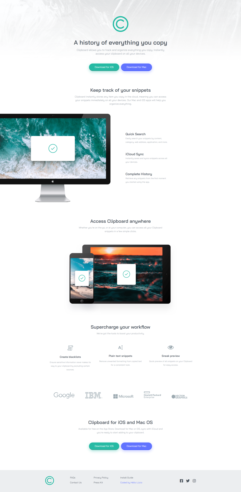
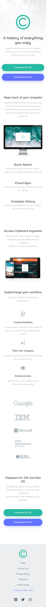

# Clip Board Landing Page

Esta é uma solução para o [Clipboard landing page challenge on Frontend Mentor](https://www.frontendmentor.io/challenges/clipboard-landing-page-5cc9bccd6c4c91111378ecb9).

## Índice

- [Geral](#geral)
  - [O Desafio](#o-desafio)
  - [Screenshot](#screenshot)
  - [Links](#links)
- [Meu Processo](#meu-processo)
  - [Feito Com](#feito-com)
- [Autor](#autor)

## Geral

### O Desafio

Os usuários devem ser capazes de:

- Visualizar o layout ideal para o site, dependendo do tamanho da tela do dispositivo
- Veja os estados de "hover" para todos os elementos interativos na página

### Screenshot

### Links

- Solution URL: https://github.com/helioLJ/clipboard-landing-page
- Live Site URL: https://helioj-clipboard.netlify.app/

## Meu Processo

### Feito com

- Semantic HTML5 markup

- CSS
- Flexbox

## Autor

- (https://github.com/helioLJ)
- Frontend Mentor - (https://www.frontendmentor.io/profile/helioLJ)
